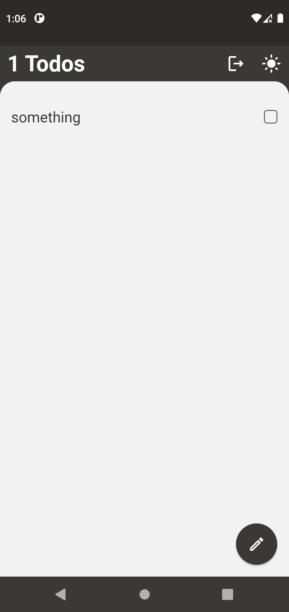
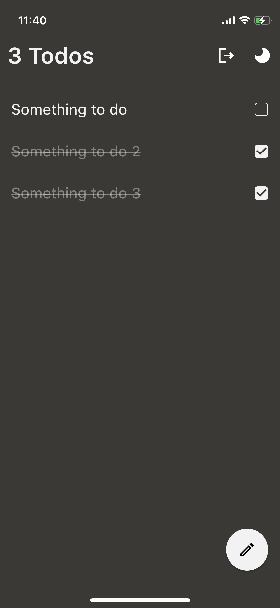
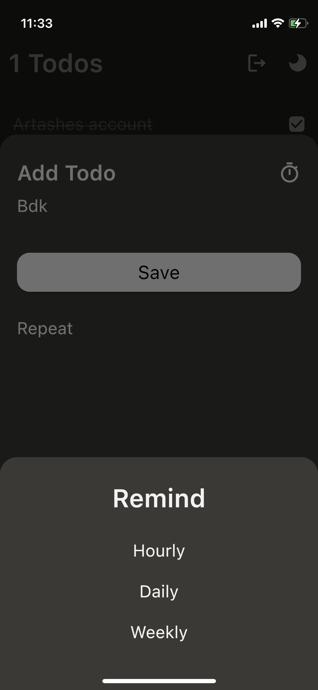

# Todos

Todo app for storing and managing tasks

## Showcase

<div style="flex-direction: row;">
    
    
    
    
</div>

## Built with

This project is built with [Flutter](https://github.com/flutter/flutter) and [Firebase](https://firebase.google.com/). local notifications are implemented with [Awesome Notifications](https://github.com/rafaelsetragni/awesome_notifications).

## Overview

This is my learning and first Flutter project and i'm still working on it.

## Getting Started

To run this project on your machine you need to have Flutter and [Xcode](https://developer.apple.com/xcode/) or [Android Studio](https://developer.android.com/studio) installed depending on which device you want to run it.

## Features

You can create/edit/delete tasks, set reminder for particular date in the future or make it repeat itself with a given interval. Sign in into your account to be able to manage tasks from several devices or create an account with email and passwords. You also can switch between light and dark modes.

### Get Started

If you want to run this project on your machine you first need to [configure your firebase project](https://firebase.google.com/docs/flutter/setup?platform=ios). After configuration is finished you should see the `firebase_options.dart` file under lib/ directory (it is not recommended to publish this file to the public since it contains your firebase project api key and a lot of other information that you might want to keep private). If everything is done properly you should be able to run the project easily with following commands.

```
$ flutter packages get
$ flutter run
```

## Contact

<artashesano@gmail.com>
