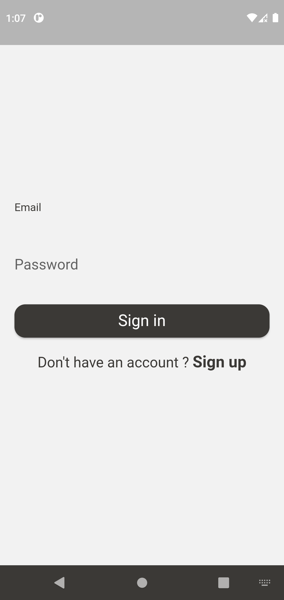

# Todos

Task manager

## Showcase

<div style="flex-direction: row;">
    
    
    
    
</div>

## Built with

This project is built with [Flutter](https://github.com/flutter/flutter) and [Firebase](https://firebase.google.com/). local notifications are implemented with [Awesome Notifications](https://github.com/rafaelsetragni/awesome_notifications).

## Overview

This was my first Flutter project that I built as the part of learning process.

## Getting Started

To run this project on your machine you need to have Flutter and [Xcode](https://developer.apple.com/xcode/) or [Android Studio](https://developer.android.com/studio) installed depending on which device you want to run it.

## Features

You can create, edit, and delete tasks. Additionally, you can set a reminder for a specific date in the future or make it repeat at a given interval. To manage tasks from any device, sign in to your account, or create an account with your email and password. Finally, you have the option to switch between light and dark modes.

### Get Started

If you want to run this project on your machine you first need to [configure your firebase project](https://firebase.google.com/docs/flutter/setup?platform=ios). After configuration is finished you'll see the `firebase_options.dart` file under `/lib` directory (it is not recommended to publish this file to the public since it contains your firebase project API keys and a lot of other information that you might want to keep private). If everything is done properly you should be able to run the project easily with following commands.

```
$ flutter packages get
$ flutter run
```

## Contact

<artashesano@gmail.com>
